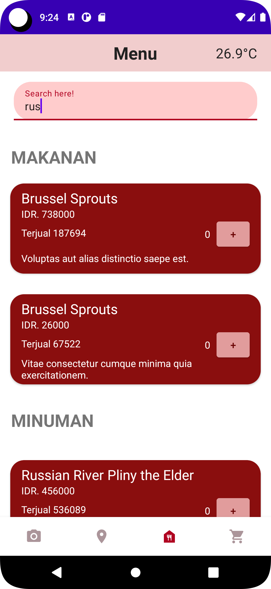
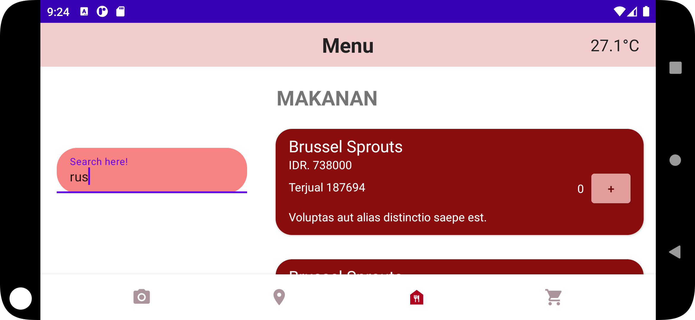
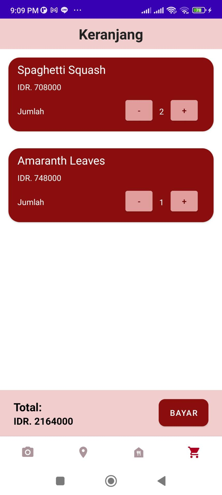
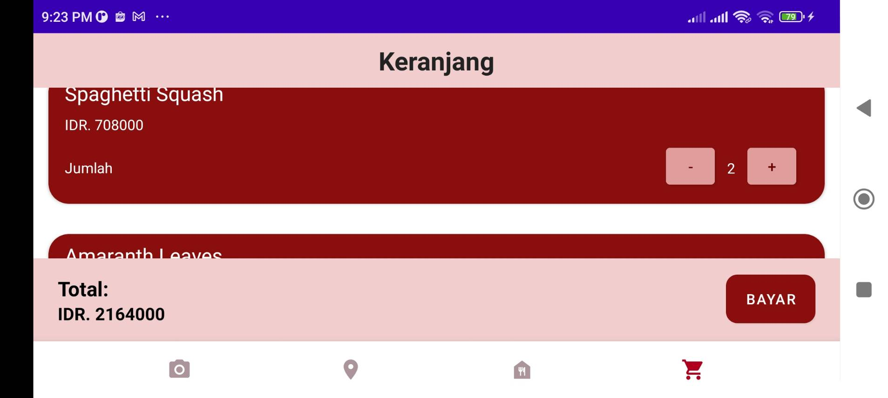
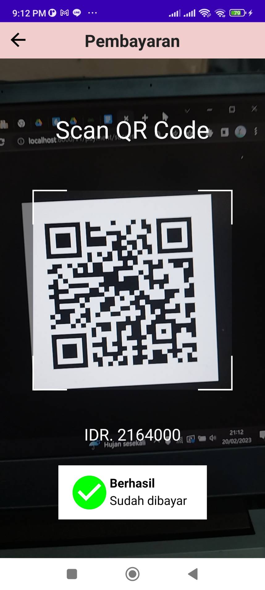
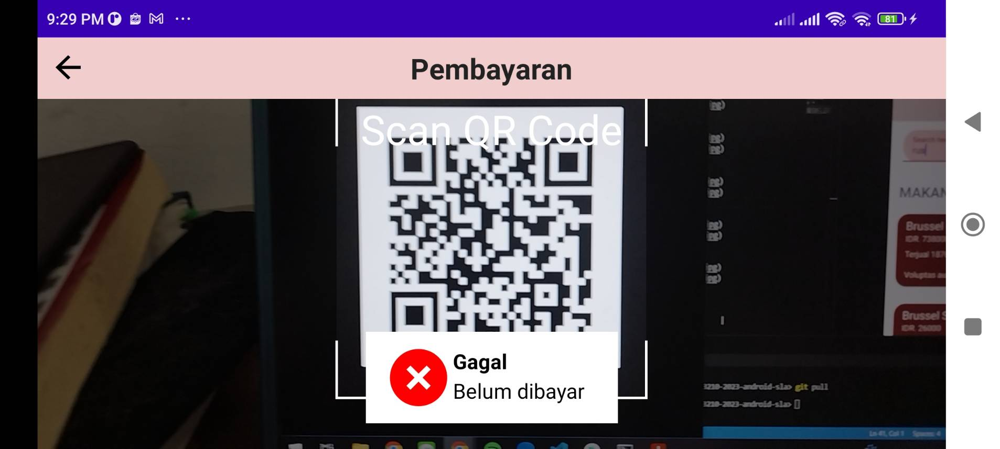
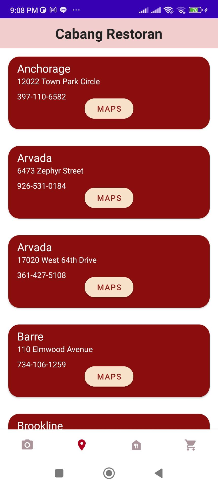
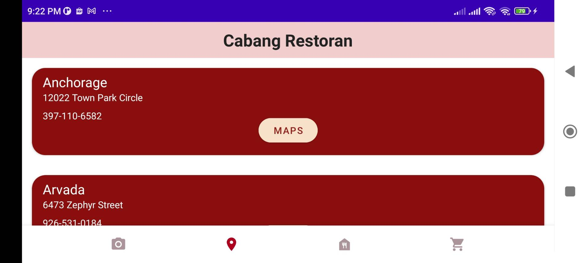
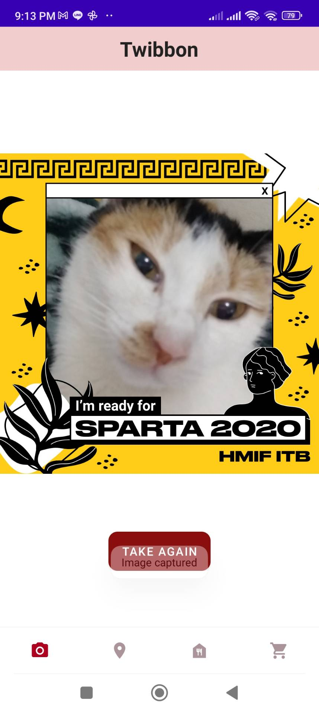
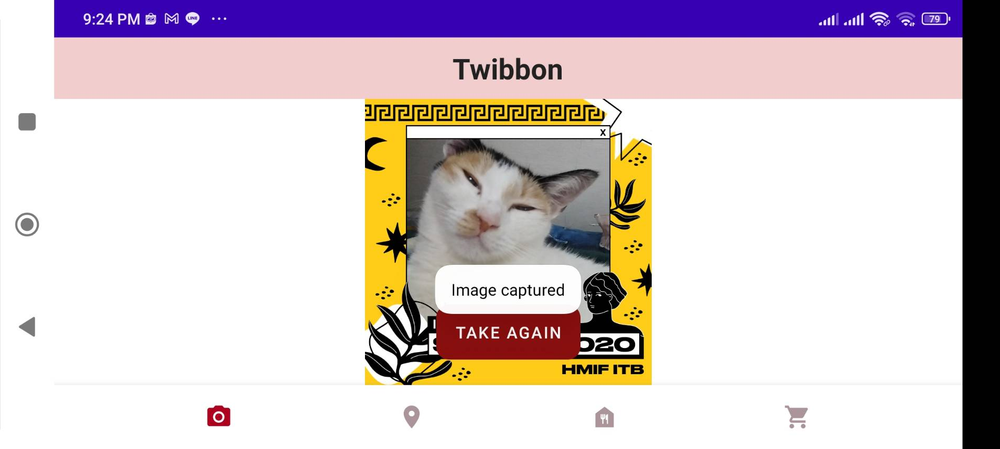

# Tugas Besar 1 - Android
## IF3210 Pengembangan Aplikasi Berbasis Platform

## Deskripsi
Aplikasi Majika merupakan aplikasi mobile untuk pembelian makanan berbasis Android. Aplikasi yang dibangun menggunakan Kotlin-Android Native ini memiliki 5 fitur sebagai berikut.
1. Fitur Daftar Makanan dan Minuman.  
    Pada halaman ini, pengguna dapat melihat informasi daftar makanan dan minuman yang tersedia. Untuk memesan makanan, pengguna perlu menambahkan menu yang mereka inginkan ke keranjang. Data makanan dan minuman yang dipilih akan disimpan di Room.
2. Fitur Keranjang.  
    Pada halaman ini, ditampilkan daftar makanan dan minuman yang akan dipesan pengguna. Pengguna dapat memodifikasi pesanannya. Tersedia pula detail harga total yang harus dibayar.
3. Fitur Pembayaran.  
    Dari halaman keranjang, pengguna dapat mengklik tombol "Bayar" dan kemudian akan diarahkan untuk melakukan scan QR Code. Jika berhasil, maka pembayaran berhasil dan keranjang dikosongkan kembali. Jika gagal, maka pengguna harus melakukan scan ulang.
4. Fitur Cabang Restoran.  
    Pada halaman ini, pengguna dapat melihat daftar cabang restoran yang. Fitur ini terhubung dengan google maps untuk melihat lokasi restoran tersebut.
5. Fitur Twibbon.  
    Fitur ini berfungsi untuk meng-capture gambar dari kamera yang sudah terpasang twibbon.

## Library
- [Retrofit](https://www.geeksforgeeks.org/retrofit-with-kotlin-coroutine-in-android/)
- [Room](https://developer.android.com/training/data-storage/room)
- [Android KTX](https://developer.android.com/kotlin/ktx)
- [Code Scanner (Yuriy Budiyev)](https://github.com/yuriy-budiyev/code-scanner)
- [CameraX]()
- [Espresso](https://developer.android.com/training/testing/espresso/basics)
- [Coroutine](https://developer.android.com/kotlin/coroutines)

## Screenshots
- Daftar makanan dan minuman

- Keranjang

- Pembayaran

- Cabang Restoran

- Twibbon

## Pembagian Kerja
| NIM      | NAMA                   | TASK                                                             |Total Jam                           |
|----------|------------------------|------------------------------------------------------------------|------------------------------------|
| 13520023 | Ahmad Alfani Handoyo   |Twibbon, Set-up backend (Retrofit), Header, Thread Management     |6 jam persiapan + 36 jam pengerjaan |
| 13520066 | Putri Nurhaliza        |Splash Screen, Cabang Restoran, Pembayaran, Navbar                |4 jam persiapan + 30 jam pengerjaan |
| 13520094 | Saul Sayers            |Daftar Makanan dan Minuman, Keranjang, Set-up Room & SQLite       |4 jam persiapan + 30 jam pengerjaan |

